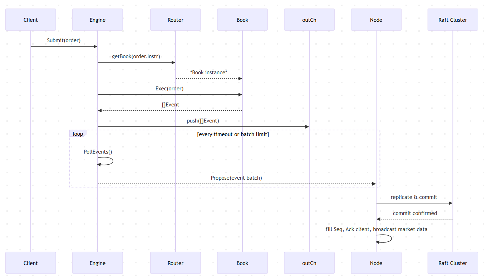

# gomatch
Implemented high-performance order matching engine written in Go, designed to handle real-time trading operations for financial markets

# Module Dependency
- **types**  
  - Defines the core data structures and interfaces:  
    - `Order`, `Trade`, `Side`, `ExecType`  
    - The `Event` interface and its implementations (`OrderAccept`, `TradeEvent`, `CancelEvent`)

- **book**  
  - Imports **types**  
  - Implements a single-instrument order book:  
    - `Book.Exec(*types.Order) ([]types.Event, error)` – run price/time-priority matching  
    - `Book.Apply(types.Event)` – replay events for a follower  
    - Internal data: price‐indexed levels + FIFO linked lists

- **engine**  
  - Imports **book** and **types**  
  - Manages many `Book` instances and exposes a simple API:  
    - **Router**: `instr → *book.Book` map  
    - **Engine**:  
      - `Submit(*types.Order)` → routes to the right `Book` and calls `Exec`  
      - `PollEvents(timeout)` → collects pending event batches for Raft  
      - `Apply(types.Event)` → routes and replays events in follower mode

---

## 2. Leader (Matching) Flow

1. Submit
- `Engine.Submit(ord)`
- Routes to `Router.getBook(instr)` → `Book.Exec(ord)`
- Pushes the resulting `[]Event` into an internal channel
2. PollEvents
- `Engine.PollEvents(timeout)`
- Drains up to N batches of events for the Node to propose via Raft
3. Raft Commit & ACK

- Node calls `raft.Propose(batch)`
- On quorum commit, Node fills each event’s `.Seq`
- Sends ACK to the client and publishes trades to the market feed
